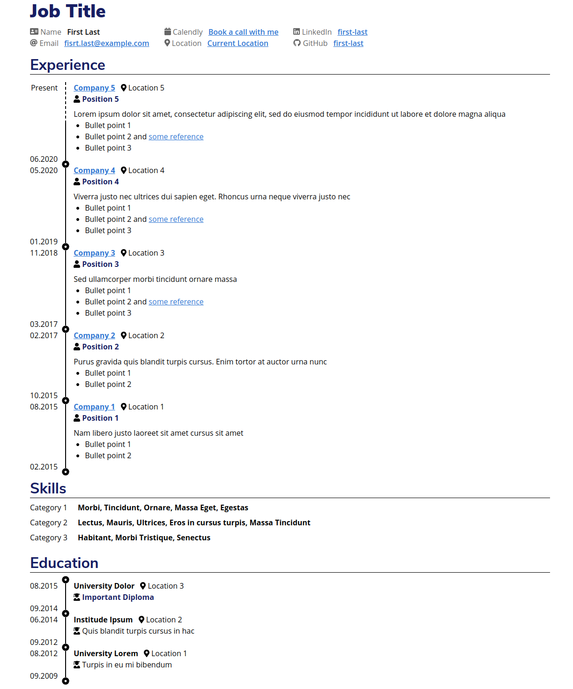
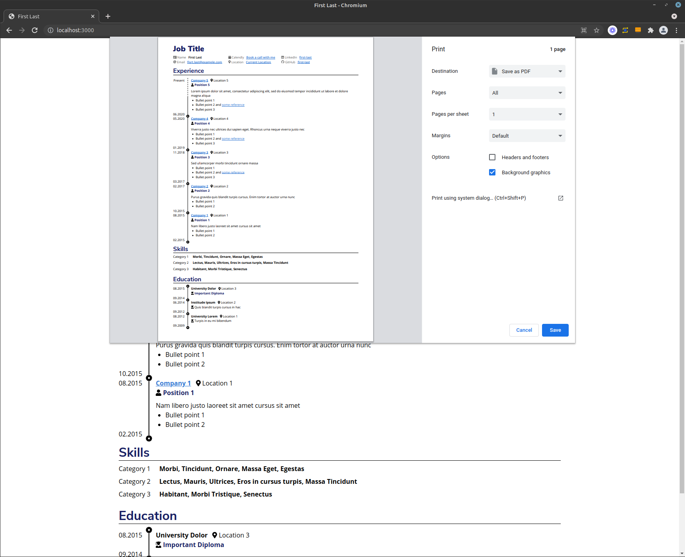

# React Resume Template

📄️ Use this project to create your CV with React




## Description

This project can be cloned and edited to create your own resume using React
components.

> Do I need to know React to use this?

Most probably yes. While editing the template to replace it with your own real
profile data is simple, getting the result to look exactly how you want will
probably require a bit of tweaking.


## Usage

```bash
# Install dependencies
yarn
# Start the dev server
yarn dev
```

You can now open http://localhost:3000 and use the print option from your
browser to print the resume as a PDF.

Note: enable the "Background graphics" option in the print menu to keep the
hyperlinks color.



## How to edit your profile data

Open `src/data/profile.tsx` and start to fill in your profile details.

The expected data types are found in `src/data/profile.types.ts`. Many fields
are typed as `ReactNode` to allow for custom content, e.g. links or bullet
point lists. 

### Section: `profileBits`

This field controls the miscellanous profile bits found just below the header.

The number of items per row can be changed in
`src/components/home/home.content.tsx`:

```typescript
<HomeProfile data={data.profile} rowCount={2} />  // Change rowCount here
```

### Section: `experience`

This field controls the data shown in the "Experience" section of the resume.

If you do not provide the `end` date of the first entry, it will use "Present"
as an end date and will be styled with a dotted line.

### Section: `studies`

This field controls the data shown in the "Education" section of the resume.

If you do not provide the `end` date of the first entry, it will use "Present"
as an end date and will be styled with a dotted line.

### Section: `skills`

This field controls the data shown in the "Skills" section of the resume.


## Under the hood

This project is powered by [Next.js](https://nextjs.org),
[React Bootstrap](https://react-bootstrap.github.io)
and [Font Awesome](https://fontawesome.com).


## Author

[Johann-Michael Thiebaut](https://github.com/leafty)


## License

This project is MIT Licensed.
